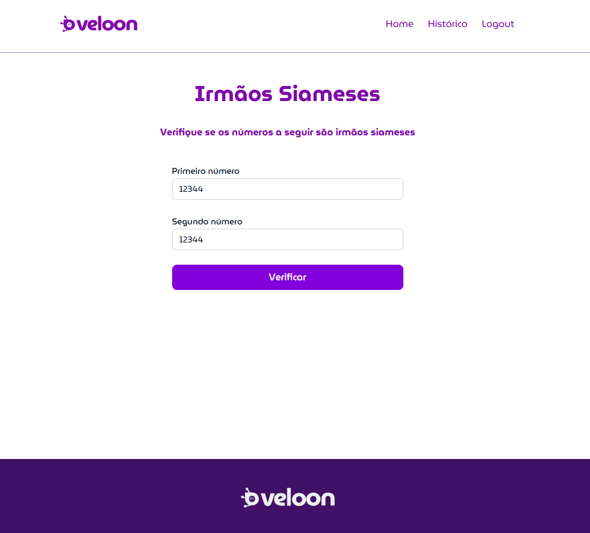

# Veloon

## Irmão siameses 2.0
  

### Para rodar o projeto localmente com Docker

- Acesse a pasta raiz do projeto e rode o comando:

  `docker-compose up -d --build`

- Acesse o app pela url:

  `http://localhost:3000`

- Api rodando na porta 3333 pela url:

  `http://localhost:3333/health`
