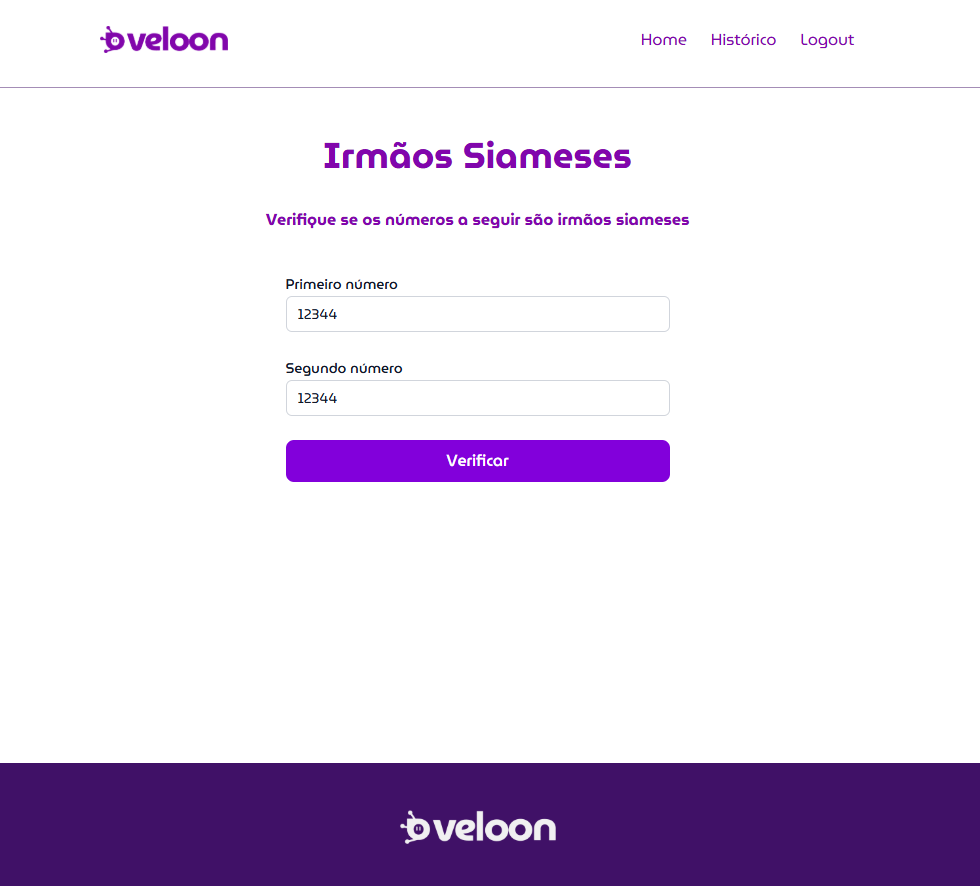
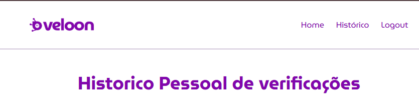

# Veloon

## Frontend - Irmão siameses 2.0

### Função principal

-   Receber dois números, verificar se os mesmos são siameses e devolver uma resposta para o usuário

### Tecnologias utilizadas

-   Vite + TypeScript + Tailwind
-   Fetch para consumo de apis

### Para rodar o projeto localmente com Docker

-   Acesse o app pela url:

    `http://localhost:3000`

### Fluxo de funcionamento do sistema

-   Usuário acessa pela url:
    -   `http://localhost:3000`
-   Se não existir sessão ativa ele será redirecionado para a tela de login
    -   `http://localhost:3000/login`
-   Se ele não possuir um login, ele deve ir para a tela de registro e criar um no login
    -   `http://localhost:3000/register`
-   Estando devidamente registrado e logado ele conseguirá acessar a tela inicial
    -   `http://localhost:3000`
-   Na tela inicial existe a função principal para comparar dois números e verificar se são siameses
    
-   Na tela de históricos traz a listagem das comparações realizadas pelo usuário com a possibilidade de exclusão de cada uma delas
-   `http://localhost:3000/historico`
    
-   Para encerrar a sessão existe a opção de logout no header da página
    
